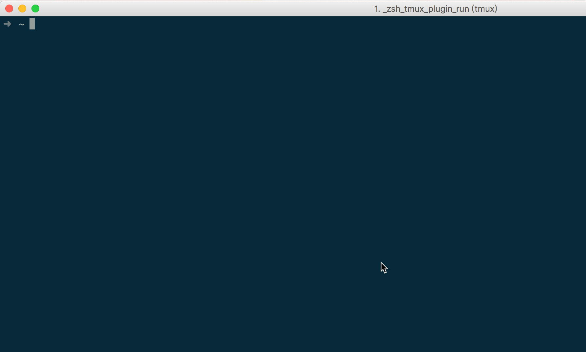

# swns
A simple plugin for kubectl to switch current context namespace.

see also [https://mritd.me/2018/08/09/create-a-plugin-for-kubectl/](https://mritd.me/2018/08/09/create-a-plugin-for-kubectl/)